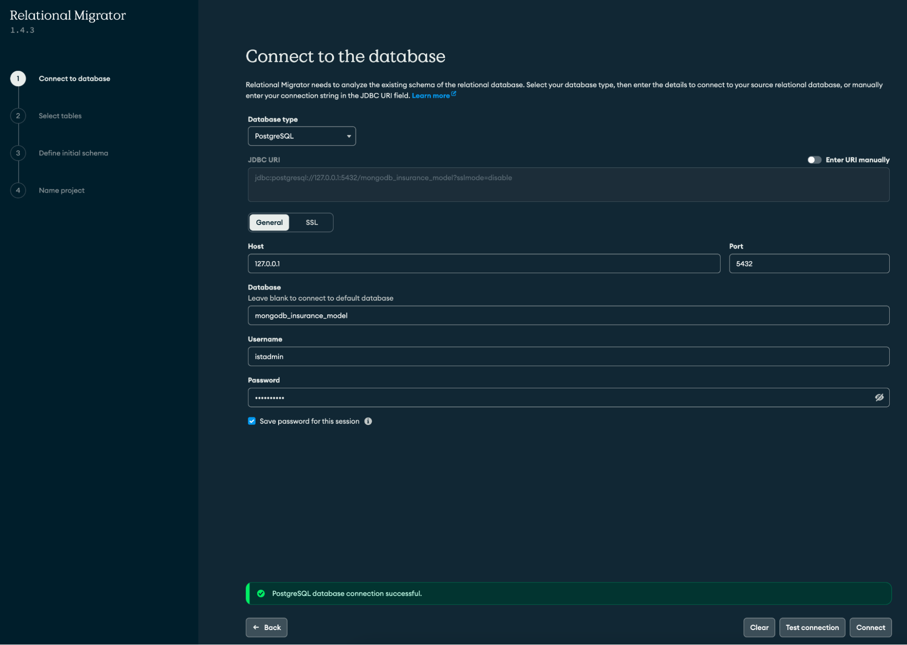

# MongoDB Insurance Model

Welcome to the *Insurance Relational Refactoring* repository! In the dynamic landscape of the insurance industry's IT systems, transitioning from legacy models to modern, flexible approaches is crucial for innovation and efficiency. This repository addresses the challenges faced by IT practitioners, offering a practical guide for refactoring the OMG Property & Casualty Insurance Data Model using MongoDB's Relational Migrator. 

**Repository Contents:**
- Hackolade Models: Explore visual representations of the data model using Hackolade's ERDs.
- Postgres Backup: Restore the original database in seconds. This backup includes sample data and it's ready to connect to MongoDB Relational Migrator. 
- DDLs: If you prefer excluding sample data, running the DDLs ensures a quick and efficient database configuration tailored to the insurance model.

> [!Note]
> For a more comprehensive step-by-step tutorial you can also visit our Insurance Data Model Migration blog (Coming soon!).

## Prerequisites
Before you begin with the tutorial please ensure you have the following prerequisites in place:

- **PostgreSQL Database Server** (version 15 or higher): PostgreSQL will be the RDBMS that holds the original tabular schema to be migrated to MongoDB. You need to have access to a cloud, on-prem or local PostgreSQL instance with permissions to create a new database and user. Download it from the official [PostgreSQL Downloads](https://www.postgresql.org/download/) site or, if you are a macOS user, just run the command `brew install postgresql@15`.
- **PostgreSQL Database Tools** (`psql`,`pg_restore`): They will be used to programatically interact with your instance, and to replicate the OMG sample database respectively. The standard ready-to-use packages will already include both the server and these client tools. Please, make sure they are added to the `PATH` after the installation. 
- **MongoDB Relational Migrator** (version 1.4.3 or higher): MongoDB Relational Migrator is a tool to help you migrate relational workloads to MongoDB. [Download Relational Migrator](https://www.mongodb.com/try/download/relational-migrator).
- **MongoDB Atlas** (M0 or higher): MongoDB is the database where we are going to migrate the data to. You can use an on-prem or local MongoDB instance, but we recommend using MongoDB Atlas for its ease of use. You can [deploy a free MongoDB Atlas Cluster](https://www.mongodb.com/docs/atlas/tutorial/deploy-free-tier-cluster/) in less than 3 minutes! 

## Replicate the OMG database

First, we need to connect to the database.

```sh
psql -h <host> -p <port> -U <user> -d <database>
```
If it’s a newly installed local instance with the default parameters, you can use `127.0.0.1` as your host, `5432` as the port, `postgres` as database, and type `whoami` in your terminal to get your default username if no other has been specified during the installation.

Once you are connected, we need to create a database to load the data.

```sh
CREATE DATABASE mongodb_insurance_model;
```

Then we will create the user that will have access to the new database, so we don’t need to use the root user in the relational migrator. Please remember to change the password in the command below.

```sh
CREATE USER istadmin WITH PASSWORD '<password>';
ALTER DATABASE mongodb_insurance_model OWNER TO istadmin;
```

Finally, we will populate the database with the "Property & Casualty Insurance Data Model". This will not only replicate the table structure, relationships and ownership, but it will also load some sample data.

1. First download the `.tar` file that contains the backup of the database. You can access it here: [mongodb_insurance_model.tar](https://github.com/mongodb-industry-solutions/mongodb-insurance-model/blob/main/mongodb_insurance_model.tar).
2. Navigate to the folder where the file is downloaded using your terminal. 
3. Run the command below to load the data. Please remember to change the host, port and user before executing the command.

```sh
pg_restore -h <host> -p <port> -U <user> -d mongodb_insurance_model mongodb_insurance_model.tar
```

After a few seconds our new database will be ready to use. Verify the successful restore by running the command below:

```sh
psql -h <host> -p <port> -U <user>-d mongodb_insurance_model -c "SELECT * FROM pg_catalog.pg_tables WHERE schemaname='omg';"
```

You should see a list of 21 tables. If all looks good, you are ready to connect your data to MongoDB Relational Migrator.

## Connect to Relational Migrator

Open the Relational Migrator App and click on the "New Project" button. We will start a new project from scratch by connecting to the database we just created. Click on "Connect database", select "PostgreSQL" as the database type, and fill in the connection details. Test the connection before proceeding and if the connection test is successful click "Connect". If a "no encryption" error is thrown, click on SSL → enable SSL.



In the next screen select all 21 tables from the omg schema and click "Next". In this new screen you will need to define your initial schema, we will start with a MongoDB schema that matches your relational schema. Leave the other options as default. Next, give the project a name and click "Done".

## Refactor Party

Open the party mapping menu and add the following mappings:

- **Person**

| Option              | Value |
| :---------------- | :------: |
| Migrate table as        |   Embedded documents   |
| Source table          |   person   |
| Merge fields into the parent  |  False   |
| Prefix |  (root)   |
| Field Name |  person   |
| Excluded fields |  -   |

- **Organization**

| Option              | Value |
| :---------------- | :------: |
| Migrate table as        |   Embedded documents   |
| Source table          |   organization   |
| Merge fields into the parent  |  False   |
| Prefix |  (root)   |
| Field Name |  organization   |
| Excluded fields |  -   |

- **Grouping**

| Option              | Value |
| :---------------- | :------: |
| Migrate table as        |   Embedded documents   |
| Source table          |   grouping   |
| Merge fields into the parent  |  False   |
| Prefix |  (root)   |
| Field Name |  grouping   |
| Excluded fields |  -   |

- **Party Location Address**

| Option              | Value |
| :---------------- | :------: |
| Migrate table as        |   Embedded array   |
| Source table          |   party_location_address   |
| Prefix |  (root)   |
| Field Name |  locationAddresses   |
| Excluded fields |  `partyIdentifier`   |

- **Location Address**

| Option              | Value |
| :---------------- | :------: |
| Migrate table as        |   Embedded documents   |
| Source table          |   location_address   |
| Merge fields into the parent  |  True   |
| Prefix |  locationAddresses  |
| Field Name |  -   |
| Excluded fields |  -  |


The resulting collection should look like the image below.


In the party domeain, party_role represents the role a party plays in a specific context such as policy, claim or litigation. It can be left out as a reference collection on its own. So it will remain unchanged in the MongoDB model.


## Refactor Party in context of Policy

Open the policy mapping menu and add the following mappings:

- **Policy Party Role**

| Option              | Value |
| :---------------- | :------: |
| Migrate table as        |   Embedded array   |
| Source table          |   policy_party_role   |
| Prefix |  (root)   |
| Field Name |  partyRoles   |
| Excluded fields |  `policyIdentifier`   |

- **Agreement**

| Option              | Value |
| :---------------- | :------: |
| Migrate table as        |   Embedded documents   |
| Source table          |   agreement   |
| Merge fields into the parent  |  False   |
| Prefix |  partyRoles   |
| Field Name |  agreement   |
| Excluded fields |  -   |

- **Policy Coverage Detail**

| Option              | Value |
| :---------------- | :------: |
| Migrate table as        |   Embedded array   |
| Source table          |   policy_coverage_detail   |
| Prefix |  coverageParts   |
| Field Name |  coverageDetails   |
| Excluded fields |  `policyIdentifier`, `coveragePartCode`   |

- **Policy Limit**

| Option              | Value |
| :---------------- | :------: |
| Migrate table as        |   Embedded array   |
| Source table          |   policy_limit   |
| Prefix |  coverageParts.coverageDetails   |
| Field Name |  limits   |
| Excluded fields |  `policyCoverageDetailIdentifier`  |

- **Policy Deductible**

| Option              | Value |
| :---------------- | :------: |
| Migrate table as        |   Embedded array   |
| Source table          |   policy_deductible   |
| Prefix |  coverageParts.coverageDetails   |
| Field Name |  deductibles   |
| Excluded fields |  `policyCoverageDetailIdentifier`  |

- **Insurable Object**

| Option              | Value |
| :---------------- | :------: |
| Migrate table as        |   Embedded documents   |
| Source table          |   insurable_object   |
| Merge fields into the parent  |  False   |
| Prefix |  coverageParts.coverageDetails   |
| Field Name |  insurableObject   |
| Excluded fields |  -   |

- **Insurable Object Party Role**

| Option              | Value |
| :---------------- | :------: |
| Migrate table as        |   Embedded array   |
| Source table          |   insurable_object_party_role   |
| Prefix |  coverageParts.coverageDetails.InsurableObject   |
| Field Name |  insurableObjectPartyRoles   |
| Excluded fields |  `insurableObjectIdentifier`  |

By now we should have a collection similar to the one below.


## Refactor Party in context of Claim & Litigation

Open the claim mapping menu and add the following mappings:

- **Claim Party Role**

| Option              | Value |
| :---------------- | :------: |
| Migrate table as        |   Embedded array   |
| Source table          |   claim_party_role   |
| Prefix |  (root)   |
| Field Name |  claimPartyRoles   |
| Excluded fields |  `claimIdentifier`  |

- **Party**

| Option              | Value |
| :---------------- | :------: |
| Migrate table as        |   Embedded documents   |
| Source table          |   party   |
| Merge fields into the parent  |  True   |
| Prefix |  claimPartyRoles  |
| Field Name |  -   |
| Excluded fields |  -   |

- **Insurable Object**

| Option              | Value |
| :---------------- | :------: |
| Migrate table as        |   Embedded documents   |
| Source table          |   insurable_object   |
| Merge fields into the parent  |  False   |
| Prefix |  (root)   |
| Field Name |  insurableObject   |
| Excluded fields |  -   |

- **Policy Coverage Detail**

| Option              | Value |
| :---------------- | :------: |
| Migrate table as        |   Embedded array   |
| Source table          |   policy_coverage_detail   |
| Prefix |  insurableObject   |
| Field Name |  policyCoverageDetails   |
| Excluded fields |  `insurableObjectIdentifier`  |

- **Litigation Party Role**

| Option              | Value |
| :---------------- | :------: |
| Migrate table as        |   Embedded array   |
| Source table          |   litigation_party_role   |
| Prefix |  (root)   |
| Field Name |  litigation   |
| Excluded fields |  `partyIdentifier`,`partyRoleCode`, `beginDate`, `claimIdentifier`, `endDate`  |

The collection show look as follows:


Now, open the litigation mapping menu and add the following mappings:

- **Litigation Party Role**

| Option              | Value |
| :---------------- | :------: |
| Migrate table as        |   Embedded array   |
| Source table          |   litigation_party_role   |
| Prefix |  (root)   |
| Field Name |  litigationPartyRoles   |
| Excluded fields |  `litigationIdentifier`  |

- **Claim**

| Option              | Value |
| :---------------- | :------: |
| Migrate table as        |   Embedded documents   |
| Source table          |   claim   |
| Merge fields into the parent  |  False   |
| Prefix |  litigationPartyRoles  |
| Field Name |  claim  |
| Excluded fields |  -   |

- **Insurable Object**

| Option              | Value |
| :---------------- | :------: |
| Migrate table as        |   Embedded documents   |
| Source table          |   insurable_object   |
| Merge fields into the parent  |  False   |
| Prefix |  litigationPartyRoles.claim   |
| Field Name |  insurableObject   |
| Excluded fields |  -   |

- **Insurable Object Party Role**

| Option              | Value |
| :---------------- | :------: |
| Migrate table as        |   Embedded array   |
| Source table          |   insurable_object_party_role   |
| Prefix |  litigationPartyRoles.claim.insurableObject   |
| Field Name |  insurableObjectPartyRoles   |
| Excluded fields |  `partyRoleCode`, `partyIdentifier`  |

The resulting collection shoudl look like the one below. 


And that’s it, we have modeled the entire relationship schema in just 5 collections: “party”, “partyRole”, “policy”, “claim” and “litigation”. You can remove the rest of the collections and compare the original tabular schema composed of 21 tables to the resulting 5 collections. 

## Migrate your data to MongoDB

Now that our model is complete, we just need to migrate the data to our MongoDB instance. First, verify that you have “dbAdmin” permissions in the destination OMG database. You can check and update permissions from the Atlas left-side security menu in the “Database Access” section. 

Once this is done, navigate to the “Data Migration” tab in the top navigation bar and click “Create sync job”. You will be prompted to add the source and destination database details. In our case, these are PostgreSQl and MongoDB respectively. Fill in the details and click “Connect” in both steps until you get to the “Migration Options” step. In this menu, we will leave all options as default, this will migrate our data in a snapshot mode, which means it will load all our data at once. Feel free to check our documentation for more [sync jobs](https://www.mongodb.com/docs/relational-migrator/jobs/sync-jobs/) alternatives. 

Finally, click the “Start” button and wait until the migration is complete. This can take a couple of minutes. Once ready, you will see the “Completed” tag in the snapshot state card. You can now connect to your database in MongoDB Atlas or Compass and check how all your data is now loaded in MongoDB ready to leverage all the advantages of the document model. 

## Additional Resources

Congratulations, you’ve just completed your data migration! What will you build next?

If you want to learn more about how MongoDB can help you modernize, move to any cloud, and embrace the AI-driven future of insurance, check our site [MongoDB for Insurance](https://www.mongodb.com/industries/insurance).
