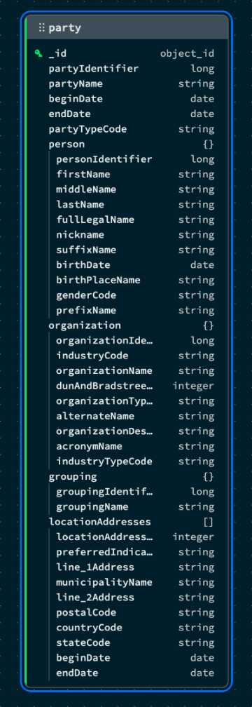

# MongoDB Insurance Model

Welcome to the MongoDB Insurance Model repository! In the dynamic landscape of the insurance industry's IT systems, transitioning from legacy models to modern, flexible approaches is crucial for innovation and efficiency. This repository addresses the challenges faced by IT practitioners, offering a practical guide for refactoring the OMG Property & Casualty Insurance Data Model using MongoDB's Relational Migrator. 

**Repository Contents:**
- Hackolade Models: Explore visual representations of the data model using Hackolade's ERDs.
- Postgres Backup: Restore the original database in seconds. This backup includes sample data and it's ready to connect to MongoDB Relational Migrator. 
- DDLs: If you prefer excluding sample data, running the DDLs ensures a quick and efficient database configuration tailored to the insurance model.

For a more comprehensive step-by-step tutorial you can also visit our Insurance Data Model Migration blog [Coming soon!].

## Prerequisites
Before you begin with the tutorial please ensure you have the following prerequisites in place:

- **PostgreSQL Database Server** (version 15 or higher): PostgreSQL will be the RDBMS that holds the original tabular schema to be migrated to MongoDB. You need to have access to a cloud, on-prem or local PostgreSQL instance with permissions to create a new database and user. Download it from the official [PostgreSQL Downloads](https://www.postgresql.org/download/) site or, if you are a macOS user, just run the command `brew install postgresql@15`.
- **PostgreSQL Database Tools** (`psql`,`pg_restore`): They will be used to programatically interact with your instance, and to replicate the OMG sample database respectively. The standard ready-to-use packages will already include both the server and these client tools. Please, make sure they are added to the `PATH` after the installation. 
- **MongoDB Relational Migrator** (version 1.4.3 or higher): MongoDB Relational Migrator is a tool to help you migrate relational workloads to MongoDB. [Download Relational Migrator](https://www.mongodb.com/try/download/relational-migrator).
- **MongoDB Atlas** (M0 or higher): MongoDB is the database where we are going to migrate the data to. You can use an on-prem or local MongoDB instance, but we recommend using MongoDB Atlas for its ease of use. You can [deploy a free MongoDB Atlas Cluster](https://www.mongodb.com/docs/atlas/tutorial/deploy-free-tier-cluster/) in less than 3 minutes! 

## Replicate the OMG database

First, we need to connect to the database.

```sh
psql -h <host> -p <port> -U <user> -d <database>
```
If it’s a newly installed local instance with the default parameters, you can use `127.0.0.1` as your host, `5432` as the port, `postgres` as database, and type `whoami` in your terminal to get your default username if no other has been specified during the installation.

Once you are connected, we need to create a database to load the data.

```sh
CREATE DATABASE mongodb_insurance_model;
```

Then we will create the user that will have access to the new database, so we don’t need to use the root user in the relational migrator. Please remember to change the password in the command below.

```sh
CREATE USER istadmin WITH PASSWORD '<password>';
ALTER DATABASE mongodb_insurance_model OWNER TO istadmin;
```

Finally, we will populate the database with the "Property & Casualty Insurance Data Model". This will not only replicate the table structure, relationships and ownership, but it will also load some sample data.

1. First download the `.tar` file that contains the backup of the database. You can access it here: [mongodb_insurance_model.tar](https://github.com/mongodb-industry-solutions/mongodb-insurance-model/blob/main/mongodb_insurance_model.tar).
2. Navigate to the folder where the file is downloaded using your terminal. 
3. Run the command below to load the data. Please remember to change the host, port and user before executing the command.

```sh
pg_restore -h <host> -p <port> -U <user> -d mongodb_insurance_model mongodb_insurance_model.tar
```

After a few seconds our new database will be ready to use. Verify the successful restore by running the command below:

```sh
psql -h <host> -p <port> -U <user>-d mongodb_insurance_model -c "SELECT * FROM pg_catalog.pg_tables WHERE schemaname='omg';"
```

You should see a list of 21 tables. If all looks good, you are ready to connect your data to MongoDB Relational Migrator.

## Connect to Relational Migrator

Open the Relational Migrator App and click on the "New Project" button. We will start a new project from scratch by connecting to the database we just created. Click on "Connect database", select "PostgreSQL" as the database type, and fill in the connection details. Test the connection before proceeding and if the connection test is successful click "Connect". If a "no encryption" error is thrown, click on SSL → enable SSL.


In the next screen select all 21 tables from the omg schema and click "Next". In this new screen you will need to define your initial schema, we will start with a MongoDB schema that matches your relational schema. Leave the other options as default. Next, give the project a name and click "Done". 

This will generate a schema that matches the original one, that is, we will have one collection per table in the original schema. This is a good starting point, but as we have seen, one of the advantages of the document model is that it is able to reduce this initial complexity.  To do so, we will take an object-modeling approach. We will focus on four top-level objects that will serve as the starting point to define the entire schema: Party, Policy, Claim and Litigation.

By default you will see an horizontal split view of the Relational (upper part) and MongoDB (lower part) model. You can change the view model from the bottom left corner "View" menu. Please note that all the following steps in the tutorial will be done in the MongoDB view (MDB), feel free to change the view mode to "MDB"  for a more spacious working view. 

## Refactor Party

Party represents people, organizations and groups. In the original schema, this is represented through one-to-one relationships. Party holds the common attributes for all parties, while each of the other three tables stores the particularities of each party class. These differences result in distinct fields for each class, which forces tabular schemas to create new tables. The inherent flexibility of the document model allows embedding this information in a single document. To do this, follow the steps below: 
- Select the "party" collection in the MDB view of Relational Migrator. At the moment, this collection has the same fields as the original matched table. 
- On the right hand side you will see the mappings menu (Figure 5). Click on the “Add” button, select “Embedded documents”, and choose "person" in the “Source table” dropdown menu. Click “Save and close” and repeat this process for the "organization" and "grouping" tables.
- After this, you can remove the "person", "organization" and "grouping" collections. Right-click on them, select “Remove Entity” and confirm “Remove from the MongoDB model”. You have already simplified your original model by three tables, and we’re just getting started. 


Looking at Figure 4 we can see that there is another entity that could be easily embedded in the party collection: location addresses. In this case, this table has a many-to-many relationship facilitated by the "party_location_address" table. As a party can have many location addresses, instead of an embedded document we will use an embedded array. You can do it in the following way:
- Select the collection "party" again, click the “Add” button, select “Embedded array”, and choose "party_location_address" in the “Source table” dropdown. Under the “All fields” checkbox, uncheck the `partyIdentifier` field. We are not gonna need it, addresses will be contained in the “party” document anyway. Leave the other fields as default and click the “Save and close” button. 
- We have now established the relationship, but we want to have the address details too. From the “party” mapping menu, click the “Add” button again. Then, select “Embedded documents”, choose “location_address”, and in the “Root path” section, check the box that says “Merge fields into the parent”. This will ensure that we don’t have more nested fields than necessary. Click “Save and close”.
- You can now delete the “party_location_address” collection, but don’t delete “location_address” as it still has an existing relationship with “insurable_object”.

You are done, the “party” entity is ready to go. We have not only reduced six tables to just one, but the “person”, “organization” and “grouping” embedded documents will only show up if that party is indeed a person, organization or grouping. One collection can contain documents with different schemas for each of these classes.



At the beginning of the section, we also spoke about the “party role” entity. It represents the role a party plays in a specific context such as policy, claim or litigation. In the original schema, this many-to-many relationship is facilitated via intermediate tables like “policy_party_role”, “claim_party_role” and “litigation_party_role” respectively. These intermediate tables will be embedded in other collections, but the “party_role” table can be left out as a reference collection on its own.  In this way, we avoid having to update one by one all policy, claim and litigation documents if one of the attributes of “party role” changes.


Let’s see next how we can model the “policy” entity.

## Refactor Party in context of Policy

From a top-level perspective, we can observe that the “policy” entity is composed of policy coverage parts and the agreements of each of the parties involved with their respective roles. A policy can have both several parts to cover and several parties agreements involved. Therefore, similarly to what happened with party location addresses, they will be matched to array embeddings. 

Let’s start with the party agreements. A policy may have many parties involved, and each party may be part of many policies. This results in a many-to-many relationship facilitated by the “policy_party_role” table. This table also covers the relationships between roles and agreements, as each party will play a role and will have an agreement in a specific policy. 
- From the MDB view, select the “policy” collection. Click on the “Add” button, select “embedded array” and choose “policy_party_role” in the source table dropdown. Uncheck the `policyIdentifier` field, leave the other fields as default and click “Save and close.”
- We will leave party as a referenced object to the “party” collection we created earlier. So we don’t need to take any further action on this, the relationship remains in the new model through the `partyIdentifier` field acting as a foreign key. However, we need to include the agreements. From the “policy” mapping  menu, click “Add”, select “Embedded document”, pick “agreement” as the source table, leave the other options as default and click “Save and close”. 
- At this point we can remove the collections “policy_party_role” and “agreement”. Remember that we have defined “party_role” as a separate reference collection, so just having `partyRoleCode` as an identifier in the destination table will be enough. 

Next, we will include the policy coverage parts. 
- From the “policy” mapping menu, click “Add”, select “Embedded array,” pick “policy_coverage_part” as source table, uncheck the `policyIdentifier` field, leave the other options as default and click “Save and close.”
- Each coverage part has details included in the “policy_coverage_detail”. We will add this as an embedded array inside of each coverage part. In the “policy” mapping menu, click “Add”, select ‘Embedded array”, pick “policy_coverage_detail” and make sure that the prefix selected in the “Root path” section is `policyCoverageParts`. Remove `policyIdentifier` and `coveragePartCode` fields and click “Save and close.”
- Coverage details include “limits’, “deductibles” and “insurableObjects”. Let’s add them in! Click “Add” in the “policy” mapping menu, “Embedded Array”, pick “policy_limit”, remove the `policyCoverageDetailIdentifier` and click “Save and close”. Repeat the process for “policy_deductible”. For “insurable_object” repeat the process but select “Embedded document” instead of “Embedded array.”
- As you can see in Figure 8, insurable objects have additional relationships to specify address and roles played by the different parties. To add them, we just need to embed them in the same fashion we have done so far. Click “Add” in the “policy” mapping menu, select “Embedded array”, and pick “insurable_object_party_role”. This is the table used to facilitate the many-to-many relationship between insurable objects and party roles. Uncheck `insurableObjectIdentifier` and click “Save and close”.  Party will be referenced by the `partyIdentifier` field. For the sake of simplicity we won’t embed address details here, but remember in a production environment you would need to add it in a similar way as we did before in the “party” collection. 
- After this, we can safely remove the collections “policy_coverage_part”, “policy_coverage_detail”, “policy_deductible” and “policy_limit”.

By now we should have a collection similar to the one below and five less tables from our original mode.


## Refactor Party in context of Claim & Litigation

In this domain, we have already identified the two main entities: claim and litigation. We will use them as top-level documents to refactor the relationships shown in Figure 10 in a more intuitive way. Let’s see how you can model claims first. 
- We’ll begin embedding the parties involved in a claim with their respective roles. Select “claim” collection, click “Add” in the mapping menu, select “Embedded array”, and pick “claim_party_role” as the source table. You can uncheck `claimIdentifier` from the field list. Last, click the “Save and close” button.
- Next, we will integrate the insurable object that is part of the claim. Repeat the previous step but choose “Embedded documents” as the table migration option, and “insurable_object” as the source table. Again, we will not embed the “location_address” entity to keep it simple. 
- Lastly, we will recreate the many-to-many relationship between litigation and claim. As we will have a separate litigation entity, we just need to reference that entity from the claims document, which means that just having an array of litigation identifiers will be enough. Repeat the previous step selecting “Embedded array”, “litigation_party_role”, and unchecking all fields except `litigationIdentifier` in the field list. 


The claim model is ready to go. We can now remove the collection “claimPartyRole”. 

Let’s continue with the litigation entity. Litigations may have several parties involved, each playing a specific role and with a particular associated claim. This relationship is facilitated through the “litigation_party_role” collection. We will represent it using an embedded array. Additionally, we will include some fields in the claim domain apart from its identifier. This is necessary so we can have a snapshot of the claim details at the time the litigation was made, so even if the claim details change, we won’t lose the original claim data associated with the litigation. To do so follow the steps below:

From the “litigation” mapping menu, click on the “Add” button, select “Embedded array” and pick “litigation_party_role” as the source table. Remove `litigationIdentifier` from the field list and click “Save and Close”. 
In a similar way, add claim details by adding “claim” as an “Embedded document”. 
Repeat the process again but choosing “insurable_object” as the source table for the embedded document. Make sure the root path prefix is set to `litigationPartyRoles.claim`.
Finally, add “insurable_object_party_role” as an “Embedded array”. The root path prefix should be `litigationPartyRoles.claim.insurableObject`.


And that’s it, we have modeled the entire relationship schema in just 5 collections: “party”, “partyRole”, “policy”, “claim” and “litigation”. You can remove the rest of the collections and compare the original tabular schema composed of 21 tables to the resulting 5 collections. 

## Migrate your data to MongoDB

Now that our model is complete, we just need to migrate the data to our MongoDB instance. First, verify that you have “dbAdmin” permissions in the destination OMG database. You can check and update permissions from the Atlas left-side security menu in the “Database Access” section. 

Once this is done, navigate to the “Data Migration” tab in the top navigation bar and click “Create sync job”. You will be prompted to add the source and destination database details. In our case, these are PostgreSQl and MongoDB respectively. Fill in the details and click “Connect” in both steps until you get to the “Migration Options” step. In this menu, we will leave all options as default, this will migrate our data in a snapshot mode, which means it will load all our data at once. Feel free to check our documentation for more sync jobs alternatives. 

Finally, click the “Start” button and wait until the migration is complete. This can take a couple of minutes. Once ready, you will see the “Completed” tag in the snapshot state card. You can now connect to your database in MongoDB Atlas or Compass and check how all your data is now loaded in MongoDB ready to leverage all the advantages of the document model. 

## Additional Resources

Congratulations, you’ve just completed your data migration! What will you build next?

If you want to learn more about how MongoDB can help you modernize, move to any cloud, and embrace the AI-driven future of insurance, check our site [MongoDB for Insurance](https://www.mongodb.com/industries/insurance).
